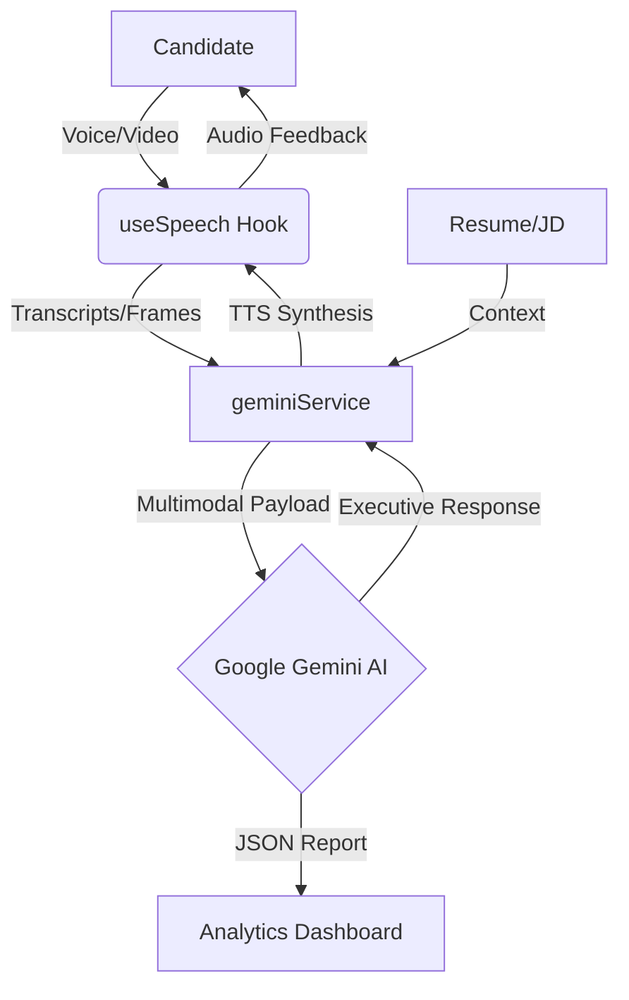

# 🚀 EasyInterview – Your Personal AI Interview Coach

<div align="center">
  
  
  
  
  
</div>

<br />

**AI-Driven • Real-Time • Multimodal Interview Coaching**

Train smarter. Interview stronger. Perform better — anytime, anywhere (24/7).

---


---


## ✨ Key Features

> **EasyInterview** is an AI-driven, real-time mock interview and career coaching platform designed to replicate realistic interview environments for job candidates.

Built with **React** and powered by **Google Gemini 1.5/2.0 Multimodal AI**, EasyInterview combines:
- 🎙️ **Voice-based interview simulation** with natural cadence.
- 🎥 **Webcam-powered behavioral analysis** (posture, eye contact).
- 📄 **Resume and role intelligence** for personalized questioning.
- 🤖 **Meet "Ava"**, your interactive AI recruiter and coach.

---

## 🎯 Mission

Bridge the gap between **interview preparation** and **real-world performance** using:
- **Data-driven coaching feedback** based on AI scoring.
- **Continuous voice practice** to eliminate filler words and hesitation.
- **Webcam-based non-verbal analysis** for professional presence.
- **Resume-aware customization** to target specific job requirements.
- **Personalized improvement roadmaps** for structured growth.

---

## ✅ Core Objectives

- Provide **realistic interview training** without the need for human interviewers.
- Build confidence via **continuous voice-based mock sessions**.
- Improve non-verbal skills through **real-time webcam coaching**.
- Deliver tailored prep using **resume + job description analysis**.
- Replace generic tips with **actionable, skill-based insights**.

---

## 🧩 System Architecture

### 🖥️ Frontend Layer (Interface)
- **Engine**: Built using **React 18** for a reactive, fast UI.
- **Media**: Live webcam integration & continuous microphone streaming.
- **UX**: Immersive interview UI featuring real-time transcriptions & adaptive question flow.
- **Coaching**: Live confidence & posture alerts rendered via subtle UI overlays.

### 🧠 AI Orchestration Layer (Brain)
- **Power**: Driven by **Google Gemini 2.0 Multimodal AI**.
- **Inputs**: Processes voice speech, live video snapshots, and text-based resume context.
- **Role**: Coordinates NLP, vision analysis, and interview logic in real-time.

### 🔊 Speech & Vision Pipeline
- **Speech-to-Text (STT)**: High-accuracy conversion of candidate responses using a **Lossless Recognition Restart Strategy**.
- **NLU (Natural Language Understanding)**: Scores clarity, relevance, and technical depth through executive-level persona modeling.
- **Visual Intelligence**: Analyzes eye gaze, head pose, and body posture balance via real-time frame serialization.

---

## 🏗️ Architectural Flow



---

## 🛠️ Engineering Excellence

### 1. Robust Speech-to-Text (STT)
The application implements an **Infinite Streaming Pattern** to circumvent browser-imposed 60-second timeouts. A "Watchdog" timer proactively restarts the recognition service during silences, ensuring zero data loss during long answers.

### 2. Full-Duplex Multimodality
Unlike traditional AI bots, EasyInterview handles **Vision and Voice concurrently**. Sequential video frames are sampled and injected into the conversational prompt, allowing the AI to provide feedback on posture *while* listening to the verbal response.

### 3. Type-Safe JSON Schemas
Analytical reports are generated using **Gemini's Structured Output** capability. We enforce a strictly defined TypeScript interface as the schema, ensuring the resulting JSON is always valid for the Recharts visualization engine.

---

## 🔁 Interview Experience Workflow

### End-to-End Mock Interview Journey
`Resume Upload` ➡️ `Profile Analysis` ➡️ `Dynamic Question Generation` ➡️ `Live Voice Interview` ➡️ `Webcam Monitoring` ➡️ `AI Evaluation` ➡️ `Full Analytics Report`

### 🧭 Detailed Process Steps
1. **Context Initialization**: Upload your resume and job description.
2. **AI Extraction**: Ava extracts skill requirements and role competencies.
3. **Session Conduct**: Engage in a 🎤 voice conversation while 🎥 visual behavior is tracked.
4. **Holistic Evaluation**: AI evaluates relevance, communication, and confidence.
5. **Instant Analytics**: Receive a multidimensional report immediately after finish.

---

## 📊 Performance Analytics Dashboard

### 📈 Performance Radar
Visualize your competency across 5 critical dimensions:
- **Answer Quality**: Technical depth and accuracy of responses.
- **Resume Alignment**: Consistency with provided credentials and role.
- **Linguistic Precision**: Professional vocabulary and communication clarity.
- **Confidence & Presence**: Audible assurance and perceived professional aura.
- **Behavioral Impact**: Strategic effectiveness using the STAR method.

### 📝 Question-Level Evaluation
- **Linguistic Clarity**: How well did you articulate your ideas?
- **Relevance Ranking**: Did you answer the specific question asked?
- **Ideal Comparisons**: AI-generated examples of "perfect" answers.

### 🧪 Resume Health Diagnostics
- **ATS Compatibility**: Score based on standard recruiter filters.
- **Skill Heatmaps**: Identifying gaps between your resume and the target JD.

---

## 📂 Project Structure

```bash
EasyInterview/
├── public/                 # Static assets
├── src/
│   ├── components/         # Core UI Components
│   │   ├── HomePage.tsx    # Onboarding & Landing
│   │   ├── SetupStep.tsx   # Config & Resume Upload
│   │   ├── Interview.tsx   # Active Multimodal Session
│   │   └── Feedback.tsx    # Post-session Reports
│   ├── services/           
│   │   └── geminiService.ts # Gemini AI Orchestration Layer
│   ├── hooks/
│   │   └── useSpeech.ts    # STT / TTS Custom Logic
│   ├── types.ts            # Centralized Interface Definitions
│   ├── utils.ts            # Helper Utilities
│   └── App.tsx             # Main Application Routing
├── .env                    # Environment Config (API Keys)
├── vite.config.ts          # Build Configuration
└── README.md               # You are here!
```

---

## 🚀 Quick Start

### 1. Prerequisites
- Node.js (v18+)
- A Google Cloud API Key for **Gemini AI**

### 2. Installation
```bash
# Clone the repository
git clone https://github.com/krish1440/EasyInterview.git

# Install dependencies
npm install

# Create .env file
touch .env
```

### 3. Environment Setup
Add your Gemini API Key to `.env`:
```env
VITE_GEMINI_API_KEY=your_actual_key_here
```

### 4. Run Development Server
```bash
npm run dev
```

---

## 🔐 Privacy & Security

- **Local Processing**: Webcam visual checks for posture are transient and designed for real-time feedback.
- **No Storage**: No video recordings are stored on our servers; only text transcripts are used for final scoring.
- **Encryption**: All data streams between the client and AI are TLS encrypted.
- **Compliance**: Designed with GDPR data-retention best practices in mind.

---

## 🛣️ Future Roadmap

- [ ] **🌍 Multilingual**: Support for interviews in 10+ languages.
- [ ] **👥 Panel Simulation**: Mocking multiple interviewers at once.
- [ ] **🏢 Company Personas**: Modeling personalities like "Stressful Recruiter" or "Technical Architect."
- [ ] **😰 Stress Conditioning**: Introducing distractions or aggressive questioning to test composure.
- [ ] **📦 Specialized Banks**: Industry-specific (FAANG, Big 4, Startups) question modules.

---

## 🛠️ Technology Stack

| Category | Technologies |
| :--- | :--- |
| **Frontend** | React, TypeScript, Tailwind CSS, Lucide Icons |
| **Core Engine** | Google Gemini Multimodal SDK |
| **Media** | MediaStream API, Web Speech API (STT/TTS) |
| **Charts** | Recharts (Radar/Grid) |
| **Build Tool** | Vite |

---

## 🏆 Why EasyInterview?

**EasyInterview transforms interview preparation into measurable performance science.**

- ✅ **Confidence** through realistic, high-pressure simulation.
- ✅ **Efficiency** via targeted AI coaching on your specific weaknesses.
- ✅ **Personalization** through deep resume/JD integration.
- ✅ **Availability** with 24/7 unlimited access to your personal recruiter.

---

<div align="center">
  <h3><b>Train Smarter. Interview Stronger. Succeed Faster.</b></h3>
  <p>© 2024 EasyInterview - Built for the next generation of top performers.</p>
</div>
